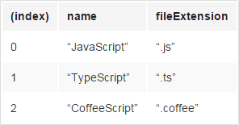
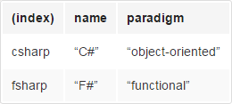

# console对象

console对象是JavaScript的原生对象，它有点像Unix系统的标准输出stdout和标准错误stderr，可以输出各种信息用来调试程序，而且还提供了很多额外的方法，供开发者调用。它的常见用途有两个。

## 1. 开发者工具

打开“开发者工具”以后，可以看到在顶端有八个面板卡可供选择，分别是：
```
Elements：用来调试网页的HTML源码和CSS代码。
Resources：查看网页加载的各种资源文件（比如代码文件、字体文件、css文件等），以及在硬盘上创建的各种内容（比如本地缓存、Cookie、Local Storage等）。
Network：查看网页的HTTP通信情况。
Sources：调试JavaScript代码。
Timeline：查看各种网页行为随时间变化的情况。
Profiles：查看网页的性能情况，比如CPU和内存消耗。
Audits：提供网页优化的建议。
Console：用来运行JavaScript命令。
```

这八个面板都有各自的用途。以下内容只针对Console面板，又称为控制台。Console面板基本上就是一个命令行窗口，你可以在提示符下，键入各种命令。

## 2. console对象的方法

console对象提供的各种方法，用来与控制台窗口互动。

### 2.1 log()，info()，debug()

console.log方法用于在console窗口输出信息。它可以接受多个参数，将它们的结果连接起来输出。
```
console.log("Hello World")
// Hello World

console.log("a","b","c")
// a b c
```

console.log方法会自动在每次输出的结尾，添加换行符。

```
console.log(1);
console.log(2);
console.log(3);
// 1
// 2
// 3
```

如果第一个参数是格式字符串（使用了格式占位符），console.log方法将依次用后面的参数替换占位符，然后再进行输出。

```
console.log(' %s + %s = %s', 1, 1, 2)
//  1 + 1 = 2
```

上面代码中，console.log方法的第一个参数有三个占位符（%s），第二、三、四个参数会在显示时，依次替换掉这个三个占位符。console.log方法支持的占位符格式有以下一些，不同格式的数据必须使用对应格式的占位符。

```
%s 字符串
%d 整数
%i 整数
%f 浮点数
%o 对象的链接
%c CSS格式字符串
```


```
var number = 11 * 9;
var color = 'red';
console.log('%d %s balloons', number, color);
// 99 red balloons
```

上面代码中，第二个参数是数值，对应的占位符是%d，第三个参数是字符串，对应的占位符是%s。

使用%c占位符时，对应的参数必须是CSS语句，用来对输出内容进行CSS渲染。

```
console.log('%cThis text is styled!',
  'color: red; background: yellow; font-size: 24px;'
)
```

上面代码运行后，输出的内容将显示为黄底红字。

console.log方法的两种参数格式，可以结合在一起使用。

```
console.log(' %s + %s ', 1, 1, '= 2')
// 1 + 1  = 2
```

如果参数是一个对象，console.log会显示该对象的值。

```
console.log({foo: 'bar'})
// Object {foo: "bar"}

console.log(Date)
// function Date() { [native code] }
```

上面代码输出Date对象的值，结果为一个构造函数。

console.info()和console.debug()都是console.log方法的别名，用法完全一样。只不过console.info方法会在输出信息的前面，加上一个蓝色图标。

console对象的所有方法，都可以被覆盖。因此，可以按照自己的需要，定义console.log方法。

```
['log', 'info', 'warn', 'error'].forEach(function(method) {
  console[method] = console[method].bind(
    console,
    new Date().toISOString()
  );
});

console.log("瞧，我在前面添加了现在的时间！");
// 2014-05-18T09:00.000Z 出错了！
```

上面代码表示，使用自定义的console.log方法，可以在显示结果添加当前时间。

### 2.2 warn()，error()

warn方法和error方法也是输出信息，它们与log方法的不同之处在于，warn方法输出信息时，在最前面加一个黄色三角，表示警告；error方法输出信息时，在最前面加一个红色的叉，表示出错，同时会显示错误发生的堆栈。其他用法都一样。

```
console.error("Error: %s (%i)", "Server is not responding",500)
// Error: Server is not responding (500)

console.warn('Warning! Too few nodes (%d)', document.childNodes.length)
// Warning! Too few nodes (1)
```

本质上，log方法是写入标准输出（stdout），warn方法和error方法是写入标准错误（stderr）。

### 2.3 table()

对于某些复合类型的数据，console.table方法可以将其转为表格显示。

```
var languages = [
  { name: "JavaScript", fileExtension: ".js" },
  { name: "TypeScript", fileExtension: ".ts" },
  { name: "CoffeeScript", fileExtension: ".coffee" }
];

console.table(languages);
```

上面代码的language，转为表格显示如下。



复合型数据转为表格显示的条件是，必须拥有主键。对于上面的数组来说，主键就是数字键。对于对象来说，主键就是它的最外层键。

```
var languages = {
  csharp: { name: "C#", paradigm: "object-oriented" },
  fsharp: { name: "F#", paradigm: "functional" }
};

console.table(languages);
```

上面代码的language，转为表格显示如下。



### 2.4 count()
count方法用于计数，输出它被调用了多少次。
```
function greet(user) {
  console.count();
  return "hi " + user;
}

greet('bob')
//  : 1
// "hi bob"

greet('alice')
//  : 2
// "hi alice"

greet('bob')
//  : 3
// "hi bob"
```
上面代码每次调用greet函数，内部的console.count方法就输出执行次数。

该方法可以接受一个字符串作为参数，作为标签，对执行次数进行分类。

```
function greet(user) {
  console.count(user);
  return "hi " + user;
}

greet('bob')
// bob: 1
// "hi bob"

greet('alice')
// alice: 1
// "hi alice"

greet('bob')
// bob: 2
// "hi bob"
```
上面代码根据参数的不同，显示bob执行了两次，alice执行了一次。

### 2.5 dir()
dir方法用来对一个对象进行检查（inspect），并以易于阅读和打印的格式显示。

```
console.log({f1: 'foo', f2: 'bar'})
// Object {f1: "foo", f2: "bar"}

console.dir({f1: 'foo', f2: 'bar'})
// Object
//   f1: "foo"
//   f2: "bar"
//   __proto__: Object
```

上面代码显示dir方法的输出结果，比log方法更易读，信息也更丰富。

该方法对于输出DOM对象非常有用，因为会显示DOM对象的所有属性。

```
console.dir(document.body)
```

### 2.6 assert()
assert方法接受两个参数，第一个参数是表达式，第二个参数是字符串。只有当第一个参数为false，才会输出第二个参数，否则不会有任何结果。

```
// 实例
console.assert(true === false, "判断条件不成立")
// Assertion failed: 判断条件不成立
```

下面是另一个例子，判断子节点的个数是否大于等于500。

```
console.assert(list.childNodes.length < 500, "节点个数大于等于500")
```


### 2.7 time()，timeEnd()
这两个方法用于计时，可以算出一个操作所花费的准确时间。

```
console.time("Array initialize");

var array= new Array(1000000);
for (var i = array.length - 1; i >= 0; i--) {
    array[i] = new Object();
};

console.timeEnd("Array initialize");

// Array initialize: 1914.481ms
```
time方法表示计时开始，timeEnd方法表示计时结束。它们的参数是计时器的名称。调用timeEnd方法之后，console窗口会显示“计时器名称: 所耗费的时间”。

### 2.8 profile()，profileEnd()
console.profile方法用来新建一个性能测试器（profile），它的参数是性能测试器的名字。

```
console.profile('p')
// Profile 'p' started.
```

console.profileEnd方法用来结束正在运行的性能测试器。

```
console.profileEnd()
// Profile 'p' finished.
```

打开浏览器的开发者工具，在profile面板中，可以看到这个性能调试器的运行结果。


### 2.9 group()，groupend()，groupCollapsed()
console.group和console.groupend这两个方法用于将显示的信息分组。它只在输出大量信息时有用，分在一组的信息，可以用鼠标折叠/展开。

```
console.group('Group One');
console.group('Group Two');

// some code

console.groupEnd(); // Group Two 结束
console.groupEnd(); // Group One 结束
```

console.groupCollapsed方法与console.group方法很类似，唯一的区别是该组的内容，在第一次显示时是收起的（collapsed），而不是展开的。

```
console.groupCollapsed('Fetching Data');

console.log('Request Sent');
console.error('Error: Server not responding (500)');

console.groupEnd();
```

上面代码只显示一行”Fetching Data“，点击后才会展开，显示其中包含的两行。


2.10 trace()，clear()
console.trace方法显示当前执行的代码在堆栈中的调用路径。

```
console.trace()
// console.trace()
//   (anonymous function)
//   InjectedScript._evaluateOn
//   InjectedScript._evaluateAndWrap
//   InjectedScript.evaluate
```

console.clear方法用于清除当前控制台的所有输出，将光标回置到第一行。


## 3. 命令行API

在控制台中，除了使用console对象，还可以使用一些控制台自带的命令行方法。

### 3.1 $_
$_属性返回上一个表达式的值。

```
2+2
// 4
$_
// 4
```

### 3.2 0−4
控制台保存了最近5个在Elements面板选中的DOM元素，0代表倒数第一个，1代表倒数第二个，以此类推直到$4。

### 3.3 $(selector)
$(selector)返回一个数组，包括特定的CSS选择器匹配的所有DOM元素。该方法实际上是document.querySelectorAll方法的别名。

```
var images = $('img');
for (each in images) {
    console.log(images[each].src);
}
```

上面代码打印出网页中所有img元素的src属性。

### 3.4 $$(selector)
$$(selector)返回一个选中的DOM对象，等同于document.querySelectorAll。

### 3.5 $x(path)
$x(path)方法返回一个数组，包含匹配特定XPath表达式的所有DOM元素。

```
$x("//p[a]")
```

上面代码返回所有包含a元素的p元素。

### 3.6 inspect(object)
inspect(object)方法打开相关面板，并选中相应的元素：DOM元素在Elements面板中显示，JavaScript对象在Profiles中显示。

### 3.7 getEventListeners(object)
getEventListeners(object)方法返回一个对象，该对象的成员为登记了回调函数的各种事件（比如click或keydown），每个事件对应一个数组，数组的成员为该事件的回调函数。

### 3.8 keys(object)，values(object)
keys(object)方法返回一个数组，包含特定对象的所有键名。

values(object)方法返回一个数组，包含特定对象的所有键值。

```
var o = {'p1':'a', 'p2':'b'};

keys(o)
// ["p1", "p2"]
values(o)
// ["a", "b"]
```

### 3.9 monitorEvents(object[, events]) ，unmonitorEvents(object[, events])
monitorEvents(object[, events])方法监听特定对象上发生的特定事件。当这种情况发生时，会返回一个Event对象，包含该事件的相关信息。unmonitorEvents方法用于停止监听。

```
monitorEvents(window, "resize");

monitorEvents(window, ["resize", "scroll"])
```

上面代码分别表示单个事件和多个事件的监听方法。

```
monitorEvents($0, "mouse");
unmonitorEvents($0, "mousemove");
```

上面代码表示如何停止监听。

monitorEvents允许监听同一大类的事件。所有事件可以分成四个大类。

```
mouse：”mousedown”, “mouseup”, “click”, “dblclick”, “mousemove”, “mouseover”, “mouseout”, “mousewheel”
key：”keydown”, “keyup”, “keypress”, “textInput”
touch：”touchstart”, “touchmove”, “touchend”, “touchcancel”
control：”resize”, “scroll”, “zoom”, “focus”, “blur”, “select”, “change”, “submit”, “reset”
```
```
monitorEvents($("#msg"), "key");
```
上面代码表示监听所有key大类的事件。

### 3.10 profile([name])，profileEnd()
profile方法用于启动一个特定名称的CPU性能测试，profileEnd方法用于结束该性能测试。

```
profile("My profile")

profileEnd("My profile")
```

### 3.11 其他方法
命令行API还提供以下方法。

```
clear()方法清除控制台的历史。
copy(object)方法复制特定DOM元素到剪贴板。
dir(object)方法显示特定对象的所有属性，是console.dir方法的别名。
dirxml(object)方法显示特定对象的XML形式，是console.dirxml方法的别名。
```

## 4. debugger语句
debugger语句必须与除错工具配合使用，如果没有除错工具，debugger语句不会产生任何结果。

在chrome浏览器中，当代码运行到debugger指定的行时，就会暂停运行，自动打开console界面。它的作用类似于设置断点。

```
for(var i = 0;i<5;i++){
    console.log(i);
    if (i===2) debugger;
}
```

上面代码打印出0，1，2以后，就会暂停，自动打开console窗口，等待进一步处理。