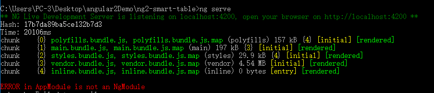
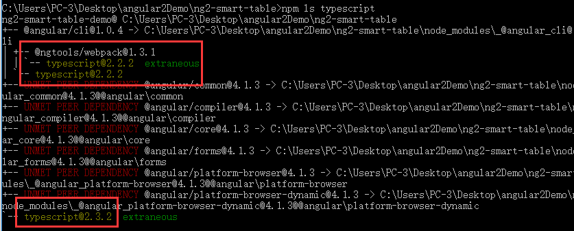
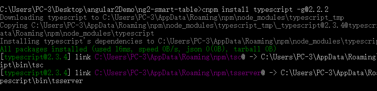
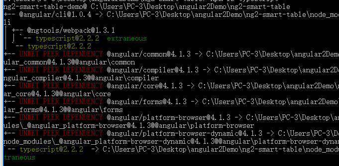

### ERROR in AppModule is not an NgModule

* 大家在 github 上看到一些好的开源项目是不是都会克隆下来跑起来试试呢？

* 当克隆下来后，ng serve 后，最常见的错误是 ERROR in AppModule is not an NgModule

* 到了这里大家就开始很头疼了，下面我说最简单的解决办法。

---

### 报错解决

1. 当运行 **ng serve**时，遇见报错如下：  

1. **npm ls typescript**  查看依赖组件。如下图：  
  
我们会发现有2个不一样，一个需要依赖的版本2.2.2 一个是已安装的版本2.3.2。  

2. 这时候我们就需要安装一个新的了：**cnpm install typescript -g@2.2.2**  
  

3. 装好后把 **package.json** 文件中的 **"typescript"** 改为: **"~2.2.2"**。

4. cnpm install重新初始化。（**必须要初始化**）。

5. 再查看一下依赖组件  **npm ls typescript**：如下图：（可省略此步）  
 

6. **ng serve**完美运行。

