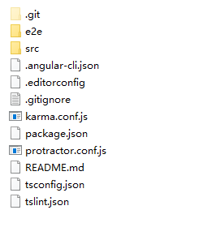
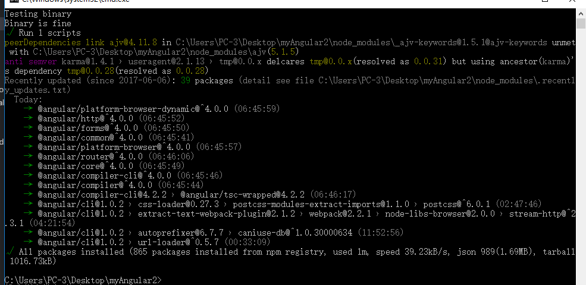

### ng2 安装环境

##### 先决条件

* 需要npm，node自带npm管理包。怎么安装node请访问：[node.js](http://nodejs.cn/)

* npm指令入口：[npm指令大全](http://www.cnblogs.com/PeunZhang/p/5553574.html)

* 安装cnpm(淘宝镜像)，至于为什么要安装淘宝镜像，简而明了：npm是访问外国服务器，安装东西慢。cnpm是淘宝的镜像，用cnpm安装是访问淘宝服务器，快！更多解释请访问：[淘宝npm镜像](https://npm.taobao.org/)

```
    $ npm install -g cnpm --registry=https://registry.npm.taobao.org
```

* 安装ng2-cli，必须安装在全局

```
    // 上面我已经装过淘宝镜像了，就可以使用cnpm了。
    cnpm install angular-cli -g
```


##### 建1个项目

* 上面安装完ng2CLI后我们就可以使用ng指令。

    - ng new myAngular2   (myangular2你的项目名)  
      
    到这一步之后 Ctrl+c 输入y，因为你不取消它会默认npm去安装依赖项 （npm安装慢）

    - 进入你的文件夹，你将看到如下结构：  
       
    在此处按住 Shift 鼠标右键，选择 再此处打开命令窗口，输入：  
    **cnpm install** 安装依赖项，如果你觉得网速很好，也可以不用执行第2步，第一步你就不用取消。

    - 安装好后：
     
    
    - 输入 **ng-serve** 启动项目：  
      

    - 打开浏览器，**http://localhost:4200**
     