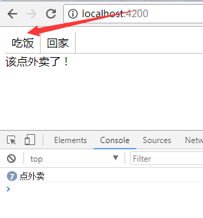

### 通过服务2遍传值（以全局工具栏为例）

#### 简述

1. 首先肯定有 工具栏组件A  全局调用的组件B 当前要用的组件C 以及1个service服务

2. 先在服务里写3个方法。 
    > onToolClick = (e) => {}  
    // 用来保存 当前 C组件 注册的事件   

    > registerToolClick(event){ this.onToolClick = event;  }  
    // C组件 用来 注册事件的过程

    > toolClick(e){ this.onToolClick(e); }  
    // 给this.onToolClick(e) 传了个值进来。

3. 上面3个方法有了，下面第一步，先在 当前要用的组件里注册事件
    > ngOnInit(){ this.srv.registerToolClick( (e) => {} )}  
    注意看，这里是调用服务里的注册事件，传了一个方法进去。 也就是说相当于服务里的  
    this.onToolClick 就是等于 event ，也就是这里穿进去的 (e) => {};

4. 然后工具栏组件要把事件给导出到全局组件，全局组件接收到这个值之后，要传到服务里
    > toolClick(){ this.srv.toolClick(e) }  
    注意看，这里是传值，调用了服务里的第3个方法， this.toolClick() 并且传了 e 进去  
    我们知道这个e就是工具栏发射出来的事件，然后把 e 传到了服务里面，传进去后它做了什么呢？  
    this.onToolClick(e) 是的，它又传给了 this.onToolClick() 了。  
    还记得第3点说的什么吗？ this.onToolClick(e)  就  等于 C组件注册的 (e) => {} 

5. 举个例子。明天有个朋友来我家，但是我不在家。我提前给他准备好，他吃饭还是走都随便他我不管。那么我在C组件就可以传  
   (e)=>{ if(e==="吃饭"){ ... }, if(e==="回家"){...}};  
   然后A组件通过 吃饭 回家等操作把事件传给B组件， B组件收到后，就吧它传给了服务里的    this.onToolClick(e)  
   也就是相当于 这里直接就得到了工具栏的传进来的 吃饭 回家，每次执行都会给我预先准备好的的处理逻辑

6. 可能这里有人疑惑，ngInit() 不是只执行一次吗？为什么后面每次操作都会执行。就像我举例那样，我已经知道我朋友要来，  
我提前准备好处理措施了（注册事件存在服务里 (e) => { ...处理逻辑 } ，实际只执行了1次） 然后朋友来了。 A组件是朋友。   
那么他来了做什么呢？B组件就把C组件做的事传给了进服务那个时间里了。 所以朋友到家我之后 吃饭也还 回家也好 都与我无关了。

7. 下面看个5分钟DEMO   

#### 5分钟小DEMO

1. 首先肯定有 工具栏组件A  全局调用的组件B 当前要用的组件C 以及1个service服务

2. 在服务里有3个方法。 1个是 一个空的函数， 

~~~
    import { Injectable } from '@angular/core';

    @Injectable()

    export class TransferenceService {
        public onToolClick = (e) => { };

        toolClick(e) {
            this.onToolClick(e);
        }

        registerToolClick(event) {
            this.onToolClick = event;
        }
    }
~~~

3. 然后在 当前要用的组件C 把事件注册到服务里

~~~
    import { Component, OnInit } from '@angular/core';
    import { TransferenceService } from '../common.service';
    @Component({
        selector: 'global',
        template: `
            <div">{{ whatDo }}

        `,
    })
    export class GlobalComponent {
        whatDo: string;
        constructor(protected srv: TransferenceService) { }
        ngOnInit() {
            this.srv.registerToolbarItemClick((e) => {
                if (e === "吃饭") {
                    this.whatDo = `自己点外卖！`;
                    console.log(`点外卖`);
                }
                if (e === "回家") {
                    this.whatDo = `回家记得锁门！`;
                    console.log(`锁门`);
                }
            })
        }
    }
~~~

4. 在工具栏组件里把点击事件导出来。导给全局调用的组件B

~~~
    import { Component, Output, EventEmitter } from '@angular/core';
    @Component({
        selector: 'tool',
        template: `
            <ul>
                <li *ngFor="let do of whatDo" (click)="toDo.emit(do)">{{ do }}</li>
            </ul>
        `,
    })
    export class ToolComponent {
        whatDo: any = ['吃饭', '回家'];

        @Output() toDo = new EventEmitter<any>();
    }
~~~

5. 全局调用的组件B 接收到 工具栏组件导出的事件。
~~~
    import { Component } from '@angular/core';
    import { TransferenceService } from '../common.service';
    @Component({
        selector: 'global',
        template: `
            <tool (toDo)="toDoFn($event)"></tool>
        `,
    })
    export class GlobalComponent {
        constructor(protected srv: TransferenceService) { }
        toDoFn(event) {
            this.srv.toolClick(event);
        }
    }

~~~

6. 样品试图：
     [02](../imgs/ng2ServiceEvent/2.png)   
    不是执行了7次，是我点击了7次。  

    [03](../imgs/ng2ServiceEvent/3.png) 

    至于ngInit() 不是指执行一次的问题，上面简述第6点有说明。

7. DEMO下载链接：[5分钟](../demo/serviceEvent)  下载下来 cnpm install一下 server跑起来。由于是5分钟DEMO，样式别吐槽！

   